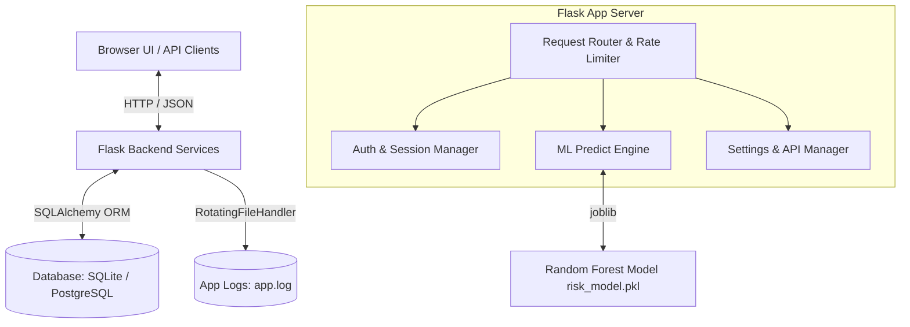
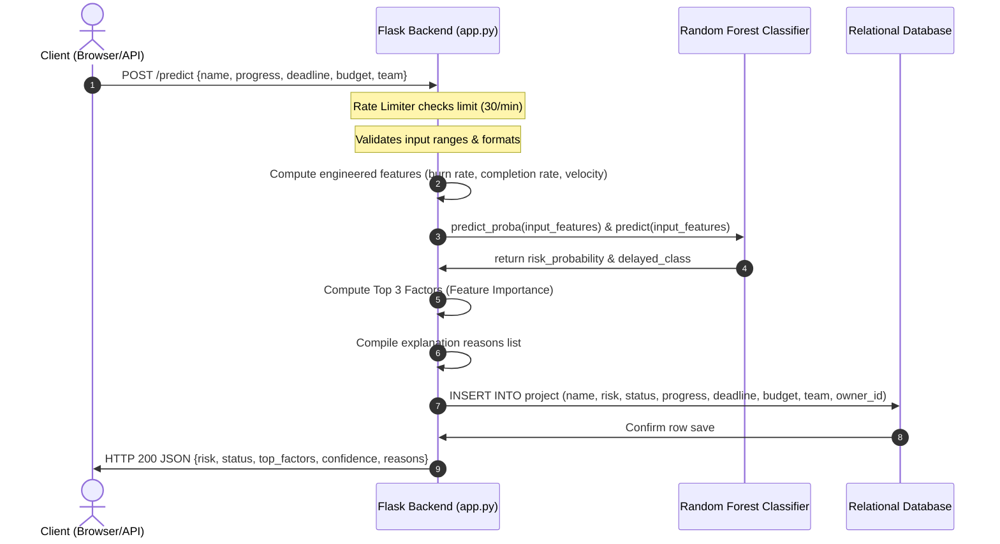
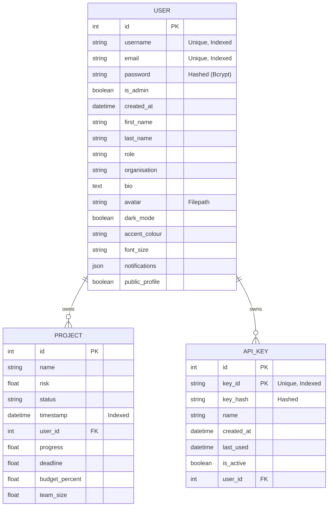

# Architecture & System Design — RiskPulse

This document provides a detailed breakdown of the technical architecture, data models, sequence flows, and security measures implemented in **RiskPulse (Real-Time Project Risk & Delay Prediction System)**.

---

## 🏛️ High-Level System Architecture

RiskPulse is designed as a secure, full-stack, single-instance web application with a modular structure combining machine learning predictions, relational storage, and interactive analytics.

---

## 🔄 Data & Request Flow

The system processes two main kinds of client interactions: **User Dashboard Interactions** (front-end forms communicating with JSON REST endpoints) and **Integrations** (API clients communicating directly using header credentials).

### ML Prediction & Database Logging Sequence

---

## 💾 Database Schema Details

The database layer utilizes **SQLAlchemy ORM** to enable smooth transitions between **SQLite** (local development) and **PostgreSQL** (production hosting). 

### 1. Entity-Relationship Diagram

### 2. Table Column Specifications

#### `user` Table
Stores authentication details, profile info, and dashboard configurations.
*   `id` (Integer, Primary Key): Autoincrement identifier.
*   `username` (String(150), Unique, Indexed, Nullable=False): Login name.
*   `email` (String(150), Unique, Indexed, Nullable=True): Verified user email.
*   `password` (String(150), Nullable=False): Secure bcrypt hashed password.
*   `is_admin` (Boolean, Default=False): Administrative permissions flag.
*   `created_at` (DateTime, Default=utc_now): Signup timestamp.
*   `first_name` / `last_name` (String(80)): Personalization names.
*   `role` (String(100)) / `organisation` (String(120)): User demographic details.
*   `bio` (Text): Multi-line descriptive bio.
*   `avatar` (String(255)): URL path to uploaded profile picture avatar.
*   `dark_mode` (Boolean, Default=False): Theme preference.
*   `accent_colour` (String(50)): Theme accent customization selection (e.g. "Aurora").
*   `font_size` (String(30)): Dashboard font size scaling preference.
*   `notifications` (JSON): Dictionary of active notification switches (e.g. email, push).
*   `public_profile` (Boolean, Default=False): Controls public accessibility of user analytics.

#### `project` Table
Records historical predictions for real-time tracking, metrics calculation, and trend charts.
*   `id` (Integer, Primary Key): Autoincrement identifier.
*   `name` (String(200), Nullable=False): User-provided name for the project.
*   `risk` (Float, Nullable=False): Predicted risk score percentage (0-100%).
*   `status` (String(50), Nullable=False): Classification string ("Delayed" or "On Track").
*   `timestamp` (DateTime, Default=utc_now, Indexed): Execution date. Used for timeseries charts.
*   `user_id` (Integer, Foreign Key, Nullable=False): Maps to `user.id`. Cascades delete on user removal.
*   `progress` (Float): Input progress percentage completion (0-100%).
*   `deadline` (Float): Input days remaining.
*   `budget_percent` (Float): Input percentage of allocated budget used.
*   `team_size` (Float): Input count of active team members.

#### `api_key` Table
Secures programmatical API access.
*   `id` (Integer, Primary Key): Autoincrement identifier.
*   `key_id` (String(16), Unique, Indexed, Nullable=False): Plain public lookup key identifier.
*   `key_hash` (String(128), Nullable=False): Secure bcrypt hash of the generated API token.
*   `name` (String(100)): Human-readable label (e.g., "CI/CD Pipeline Key").
*   `created_at` (DateTime, Default=utc_now): Timestamp when created.
*   `last_used` (DateTime): Timestamp of the last authenticated prediction request.
*   `is_active` (Boolean, Default=True): Soft-enable key flag.
*   `user_id` (Integer, Foreign Key, Nullable=False): Owner mapping to `user.id`. Cascades delete.

---

## 🔒 Security Architecture

The system implements multiple layers of defensive security controls to protect resources and prevent abuse:

1.  **Password Hashing**: Uses `Flask-Bcrypt` (Blowfish-based key-derivation function) to hash credentials. Cleartext passwords are never processed or logged outside of memory.
2.  **Session Hardening**: Sets production cookie security attributes to prevent interception:
    *   `SESSION_COOKIE_SECURE = True` (Requires HTTPS connection).
    *   `SESSION_COOKIE_HTTPONLY = True` (Prevents client-side scripts from reading cookie content, blocking XSS-based token theft).
    *   `SESSION_COOKIE_SAMESITE = "Lax"` (Protects against CSRF attacks).
    *   `PERMANENT_SESSION_LIFETIME = 3600` (Enforces automatic idle-timeout after 1 hour).
3.  **API Key Safety**: Generated keys (`rp_live_...`) are sent once in the HTTP response and never displayed again. Only the cryptographic hash is stored.
4.  **File Upload Restrictions**: Prevents server exploits via avatar uploads:
    *   `MAX_CONTENT_LENGTH = 2 * 1024 * 1024` limits uploads to 2MB. Larger payloads trigger HTTP 413.
    *   Strict extension allowlist check (`jpg`, `jpeg`, `png`, `gif`, `webp`).
    *   Upload filenames are completely randomized (`avatar_[user_id]_[secure_token].[ext]`) to prevent path traversal attacks.
5.  **Rate Limiting**: Uses `Flask-Limiter` with an in-memory key-value store mapping remote addresses to rate-counters:
    *   General defaults: `200 requests/day`, `50 requests/hour`.
    *   `POST /predict`: `30 requests/minute` (protects prediction server computing resources).
    *   `POST /login` & `/register`: `10 requests/minute` and `5 requests/hour` (mitigates brute-force attacks and registration spam).

---

## ⚠️ Error Handling & Logging

### Error Dispatcher
Routes standard web/API server error codes to formatted JSON responses:
*   `404 Not Found`: Returns standard not found JSON message.
*   `413 Payload Too Large`: Triggered when file uploads exceed 2MB.
*   `429 Too Many Requests`: Triggered when rate limits are violated.
*   `500 Internal Server Error`: Safely logs stack trace, rolls back database transactions (`db.session.rollback()`), and returns generic response (hides implementation specifics).

### Production Logging
When debug mode is inactive (`FLASK_ENV=production`), the application utilizes a `RotatingFileHandler` writing structured logs to `logs/app.log`:
*   **Rotation Size**: 10MB maximum file size.
*   **Retention**: Keeps up to 10 rotated log files.
*   **Log Format**: `[Timestamp] [LogLevel]: [Message] [in file_path:line_number]`
